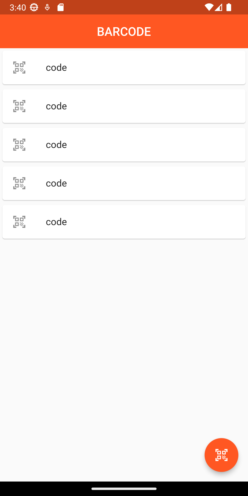

#  Barcode

Desenvolver projetos práticos, como o projeto de Consolidação de Dados em uma Base de Dados Local, é uma abordagem altamente benéfica para consolidar o conhecimento e aprimorar suas habilidades de programação em Flutter. Além disso, é uma maneira envolvente e divertida de aplicar o que você aprendeu em um contexto real. Aqui estão alguns detalhes adicionais sobre essa abordagem

### Portfólio Pessoal

## Getting Started

<table>
 <tr>
  <td>
    <div>
     ### Execute o seguinte comando para obter as dependências:
     1. **Primeiro passo:** 
      ```
        flutter pub get && dart pub get
      ```
     2. **Segundo passo:** 
      ```
        flutter run
      ```
    </div>
    </td>
   <td>
     <div style="display: grid; grid-template-columns: 1fr 140px; gap: 20px; align-items: center;"> 
    <div style="text-align: right;">
        
    </div>
</div>
   </td>
  </td>
 </tr>

</table>


This project is a starting point for a Flutter application.

A few resources to get you started if this is your first Flutter project:

- [Lab: Write your first Flutter app](https://docs.flutter.dev/get-started/codelab)
- [Cookbook: Useful Flutter samples](https://docs.flutter.dev/cookbook)

For help getting started with Flutter development, view the
[online documentation](https://docs.flutter.dev/), which offers tutorials,
samples, guidance on mobile development, and a full API reference.
